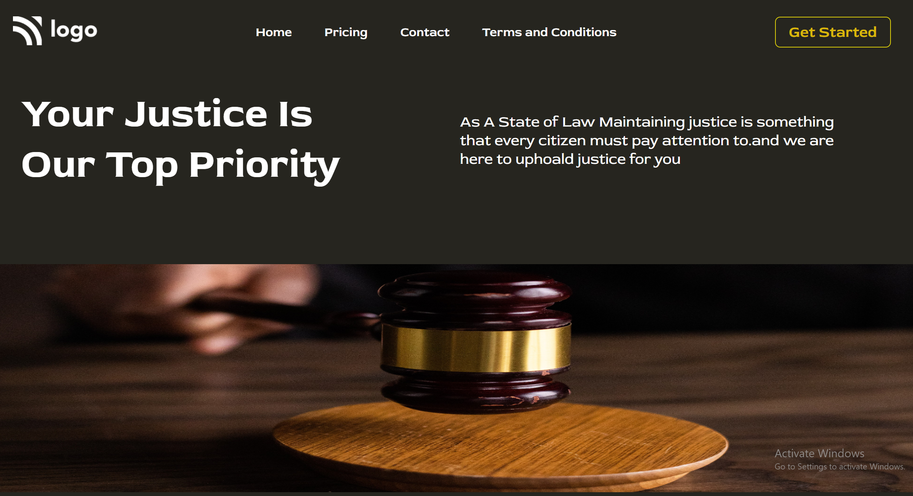

# Assignment - 3 - HTML  and CSS 

## Project 3 - [Live Link](https://full-stack-js-proj-3.netlify.app/)

---

### Skills Gained in this project

- Learnd to Place an image inside div and centering image.
- I also learned how to add diffrent fonts from the Google Fonts
- I also learned how to design Buttons and Navbar.
- I also learned how to use margin and padding.

---

## Time taken to finish this project

- 2 hour to complete it.

#### Screenshot

